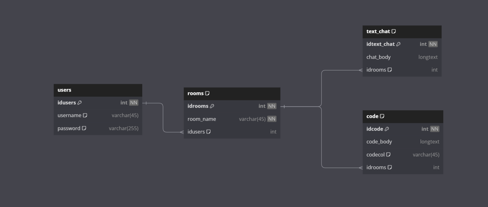

# Flask Chat Application

This is a simple chat application built using Flask and Flask-SocketIO. It allows users to log in, chat in different rooms, and collaborate on code in real-time.
>[!NOTE]
This project is for me to have a better understanding of how Sockets work.
>[!WARNING]
>This is not a product and should not be used in a production environment as it lacks proper security measures and is not yet scalable.

## Table of Contents

- [Features](#features)
- [Getting Started](#getting-started)
  - [Prerequisites](#prerequisites)
  - [Installation](#installation)
- [Usage](#usage)
- [Contributing](#contributing)
- [License](#license)

## Features

- User authentication: Users can log in with their username and password.
- Chat rooms: Users can join different chat rooms and communicate with others.
- Real-time code collaboration: Users can edit code in real-time with other users.
- Multi-language support: Users can choose their preferred coding language.

## Work In Progress (WIP)
- Ability to retrieve old coding sessions.
- Invite link to a specific code session.
- Sign up page.
- Code highlighting and name over cursor.
- "Who's Connected" feature.
- Dark mode.

## Getting Started

### Prerequisites

Before you begin, ensure you have met the following requirements:

- Python 3.6+
- MySQL database
- Git (optional, for cloning the repository)

### Installation

1. Clone the repository (if you haven't already):

   ```shell
   git clone https://github.com/AmjedAshour/codeEdit.git
   ```
2. Navigate to the project directory by running the following command, replacing project/directory with the actual path to your project folder:
    ```shell
    cd project/directory
    ```
2. Install the required Python packages:
    ```pip
   pip install -r requirements.txt
   ```
3. Configure the MySQL database settings in the app.py file:
   ```shell
    app.config['MYSQL_HOST'] = 'localhost'
    app.config['MYSQL_USER'] = 'your-username'
    app.config['MYSQL_PASSWORD'] = 'your-password'
    app.config['MYSQL_DB'] = 'Database-Name'
    ```
4. Set the secret key in the app.py file:
   ```shell
    app.config['SECRET_KEY'] = 'your-secret-key'
    ```
5. Create the necessary database tables.
6. Start the Flask application:
    
    ```shell
    python app.py
    ```
## Usage
1. Open a web browser and navigate to http://localhost:5000 (or the address where your Flask app is running).

2. Log in with your username and password.

3. Explore the chat rooms and code collaboration features.

## Contributing
Contributions are welcome! If you'd like to contribute to this project, please follow these steps:

1. Fork the project
2. Create your feature branch
    ```shell
    git checkout -b feature/your-feature-name
    ```
3. Commit your changes
    ```shell
    git commit -m 'Add some feature'
    ```
4. Push to the branch
    ```shell
    git push origin feature/your-feature-name
    ```
5. Create a new pull request.

## Database Structure

```shell

Table "code" {
  "idcode" int [pk, not null, increment]
  "code_body" longtext
  "codecol" varchar(45) [default: NULL]
  "idrooms" int [default: NULL]

Indexes {
  idrooms [name: "idrooms"]
}
}

Table "rooms" {
  "idrooms" int [pk, not null, increment]
  "room_name" varchar(45) [not null]
  "idusers" int [default: NULL]

Indexes {
  idusers [name: "idusers"]
}
}

Table "text_chat" {
  "idtext_chat" int [pk, not null, increment]
  "chat_body" longtext
  "idrooms" int [default: NULL]

Indexes {
  idrooms [name: "idrooms"]
}
}

Table "users" {
  "idusers" int [pk, not null, increment]
  "username" varchar(45) [default: NULL]
  "password" varchar(255) [default: NULL]
}

Ref "code_ibfk_1":"rooms"."idrooms" < "code"."idrooms"

Ref "rooms_ibfk_1":"users"."idusers" < "rooms"."idusers"

Ref "text_chat_ibfk_1":"rooms"."idrooms" < "text_chat"."idrooms"
```


## License
This project is licensed under the [MIT License](LICENSE).
